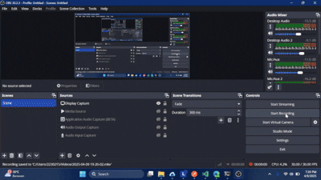

# Simple Applicant Tracker React

A simple Applicant Tracking System built with React (frontend) and Express.js (backend), designed in a monorepo architecture.

This repository contains 2 main parts:
- `backend/` → Express.js + PostgreSQL API
- `frontend/` → React + Vite + Tailwind + Shadcn UI Interface

---

## Features

- Manage Applicants (CRUD)
- Filter & Search Applicants
- View Applicant Details
- RESTful API Backend
- Clean & Responsive Frontend
- Easy to Setup & Run

---

## Project Structure

```
simple_applicant_tracker_react/
├── backend/     # Backend Source Code
├── frontend/    # Frontend Source Code
├── package.json # Root Configuration
└── README.md
```

---

## Installation & Running the Project

### 1. Clone Repository

```bash
git clone https://github.com/Cloud-Dark/simple_applicant_tracker_react.git
cd simple_applicant_tracker_react
```

### 2. Install All Dependencies (Root, Backend, Frontend)

```bash
npm run install-all
```

### 3. Run Project (Backend & Frontend Concurrently)

```bash
npm start
```

> Backend available at: http://localhost:5000  
> Frontend available at: http://localhost:5173  

---

## Available Scripts

| Script                | Description                                  |
|----------------------|----------------------------------------------|
| npm run install-all  | Install all dependencies (backend, frontend, root) |
| npm run install-backend | Install backend dependencies only        |
| npm run install-frontend | Install frontend dependencies only      |
| npm start            | Run backend & frontend concurrently         |

---

## Tech Stack

### Backend
- Express.js
- PostgreSQL
- Sequelize ORM

### Frontend
- React.js
- Vite
- TailwindCSS
- Shadcn UI
- React Router
- React Query

### Supporting Tools
- concurrently (run multiple commands together)
- npm-run-all (automation for multiple npm scripts)

---


## 📽️ Demo Previews

| Frontend | Backend |
|---------|---------|
|  |  |

---

## TODO List

### Global (Root)
- [x] Setup Backend & Frontend structure
- [x] Setup Root Runner (concurrently & npm-run-all)
- [ ] Improve global error handling (Backend & Frontend)

### Frontend
- [x] Make Edit / Review button work smoothly  
    - Current: only updating form data (edit)  
    - Target: after saving → auto refresh/update:
        - Applicant Details View
        - Applicant Table List  
- [x] Auto refetch applicant data after update
- [x] Add toast notification on successful update
- [x] Add responsive feature for mobile view
- [ ] Add loading state while fetching/updating data

### Backend
- [ ] Improve data validation (e.g., email format)
- [ ] Optional pagination feature
- [ ] Optional sorting feature
- [ ] Optional advanced filtering (by skill, by city, etc.)

---

## Repository

GitHub: [https://github.com/Cloud-Dark/simple_applicant_tracker_react](https://github.com/Cloud-Dark/simple_applicant_tracker_react)

---

## License

ISC License

---

## Issues or Contributions?

Feel free to open an issue or pull request here:  
[https://github.com/Cloud-Dark/simple_applicant_tracker_react/issues](https://github.com/Cloud-Dark/simple_applicant_tracker_react/issues)
